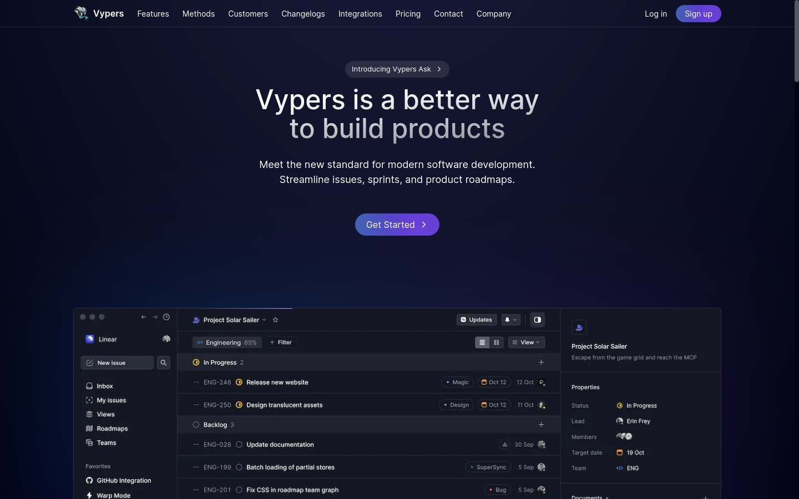

## Purpose

Put advanced tailwind, animations and cva into practice in react. Creating a modern landing page that shows a demo of a system.

### Setup

```bash
npm i

pnpm i

bun i
```

### Run

```bash
npm run dev

pnpm run dev

bun dev
```
